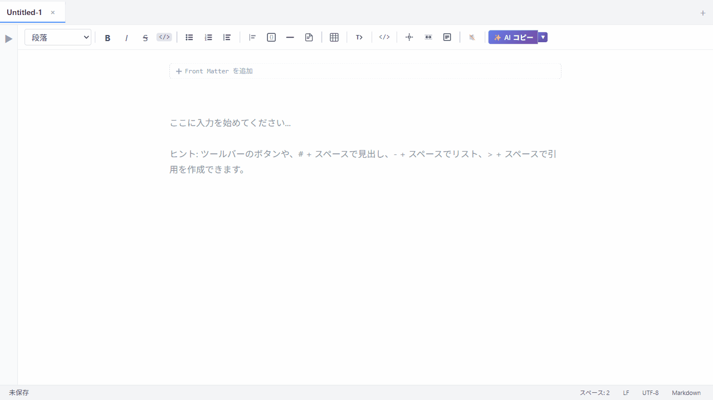
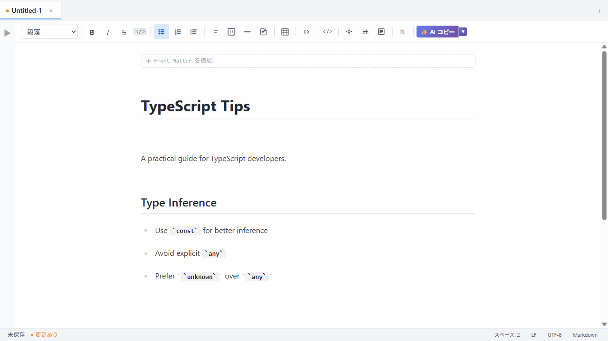
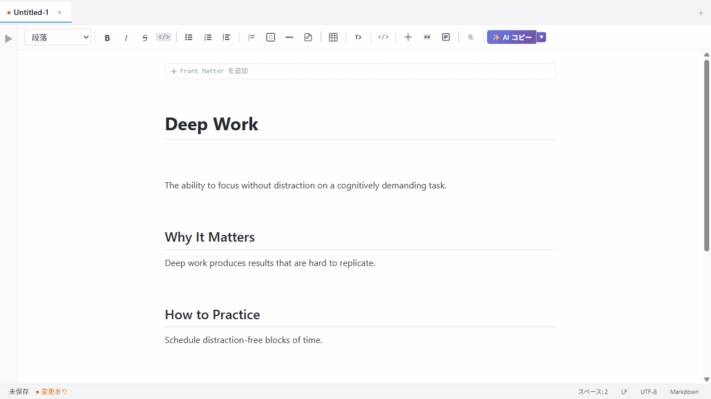

# MarkWeave

**Markdown 記法を見ずに書いて、技術記事をそのまま公開できるローカル WYSIWYG エディタ。**

Windows / Linux 対応 · ローカルファースト · 買い切り $24.99

**[➡ Gumroad で購入する](https://xdhyskh.gumroad.com/l/qwctrq)**

---

## こんな不満、ありませんか？

- **Typora で書いている** → 気持ちいいが、Zenn / Qiita に合わせた公開フローが弱い
- **VS Code + プレビューで書いている** → ウィンドウを行き来するたびに書くリズムが崩れる
- **ChatGPT / Claude に貼るとき毎回手作業で整形している** → 見出しレベルがずれていたり、言語タグが抜けていたり
- **ファイルはローカルに持ちたい** → Notion や HackMD のクラウド依存が嫌

MarkWeave はこの 4 つを、余計な機能を足さずに解決するために作りました。

---

## 解決策

### 1. 記法を見ずに書ける（Typora 式 WYSIWYG）

`# ` を入力した瞬間に見出しに変わる。`- ` でリストに。
Markdown を知っている人が「記法を見なくて済む」書き心地。



---

### 2. コードブロックごと HTML に書き出せる

シンタックスハイライト・数式・Mermaid 図表を含む記事を、スタンドアロン HTML としてそのまま出力。
画像は Base64 で埋め込まれるのでリンク切れゼロ。Zenn / Qiita へのコピーにも使える。


---

### 3. AI に貼る前の整形が不要になる

**[AI コピー]** ボタン一つで、見出し階層の補正・コードブロックへの言語タグ付け・余分な空行の削除を自動処理してクリップボードへコピー。
そのまま Claude / ChatGPT に貼れる。



---

### 4. 書くことだけに集中できる

フォーカスモード・タイプライターモード・Zen モードで、ツールの存在を消せる。



---

## 主な機能

### 執筆

| 機能 | 説明 |
|------|------|
| WYSIWYG 編集 | 入力と同時に整形。`Ctrl+/` でいつでもソース表示に切り替え |
| テーブル | D&D での並び替え・列幅リサイズ・セル間 Tab 移動 |
| コードブロック | シンタックスハイライト付き。40+ 言語対応 |
| 数式（KaTeX） | `$...$` インライン / `$$...$$` ブロック |
| Mermaid 図表 | フローチャート・シーケンス図等をインライン表示 |
| フォーカス / タイプライター / Zen | 集中執筆モード 3 種（F8 / F9 / F11） |
| スラッシュコマンド | `/` でブロック・テンプレートを素早く挿入 |
| ポモドーロ / ワードスプリント | 執筆セッション管理ツール |

### エクスポート

| 形式 | 説明 |
|------|------|
| HTML | テーマ選択付きスタンドアロン HTML。画像 Base64 埋め込み（`Ctrl+Shift+E`） |
| PDF | 印刷品質 PDF 出力（`Ctrl+Alt+P`） |
| Word / LaTeX / ePub | Pandoc 連携（要 Pandoc インストール） |

### AI 機能（BYOK）

自分の Claude API キーを設定して使います。当アプリは API コストを負担しません。

| 機能 | 説明 |
|------|------|
| AI コピー | 見出し補正・言語タグ付け・余白整形 → クリップボードへ |
| AI テンプレート | ブログ構成・コード解説・会議メモ等のテンプレートを挿入 |
| テキスト選択 AI アシスト | 選択範囲を Claude API で改善 / 翻訳 / 要約 |

---

## ダウンロード

**[➡ Gumroad で購入する（$24.99）](https://xdhyskh.gumroad.com/l/qwctrq)**

購入後、最新版（Windows `.msi` / Linux `.AppImage`）のダウンロードリンクが届きます。

> Windows で SmartScreen 警告が出た場合は「詳細情報 → 実行」で回避できます。

---

## ソースからビルドする（開発者向け）

ソースからビルドする場合:

### 必要な環境

| ツール | バージョン |
|--------|-----------|
| [Node.js](https://nodejs.org/) | 20 以上 |
| [pnpm](https://pnpm.io/) | 9 以上 |
| [Rust](https://rustup.rs/) | 1.77.2 以上 |
| [Tauri 前提条件](https://v2.tauri.app/start/prerequisites/) | OS ごとの依存ライブラリ |

> **Linux:** `webkit2gtk`・`libayatana-appindicator3` 等が必要です。[Tauri 公式ドキュメント](https://v2.tauri.app/start/prerequisites/#linux) を参照してください。

```bash
git clone <repository-url>
cd markweave
pnpm install
pnpm tauri dev   # デスクトップアプリとして起動
```

---

## 動作環境・サポート

| 項目 | 内容 |
|------|------|
| 対応 OS | Windows 10/11、Linux（x86-64） |
| macOS | 未対応（開発者が Mac を所持していないため動作確認不可） |
| ライセンス | MIT |
| 価格（予定） | 買い切り $24.99、3 デバイスまで。サブスクなし |
| アップデート | アプリ内自動アップデート（署名済みパッケージ） |
| サポート | GitHub Issues |
| データ | すべてローカル保存。外部送信なし |

詳細（既知の制限・返金ポリシー・プライバシー）: **[SUPPORT.md](./SUPPORT.md)**

---

## テスト

```bash
pnpm test                  # ユニット・統合テスト（Vitest）
pnpm test:e2e              # E2E テスト（Playwright）
npm run test:roundtrip     # Markdown ↔ TipTap JSON ラウンドトリップテスト
```

---

## 技術スタック

| レイヤー | 技術 |
|---------|------|
| デスクトップ基盤 | Tauri 2.0（Rust） |
| フロントエンド | React + TypeScript + Vite |
| エディタエンジン | TipTap（ProseMirror）+ CodeMirror 6 |
| 状態管理 | Zustand |
| スタイル | Tailwind CSS |
| テスト | Vitest + Playwright |

---

## 設計ドキュメント（開発者向け）

| ドキュメント | 内容 |
|------------|------|
| [design-index.md](./docs/00_Meta/design-index.md) | 設計ファイル索引 |
| [feature-list.md](./docs/00_Meta/feature-list.md) | 機能一覧・ショートカット |
| [system-design.md](./docs/01_Architecture/system-design.md) | システム全体設計 |
