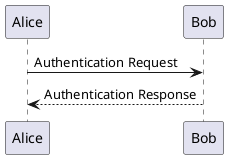
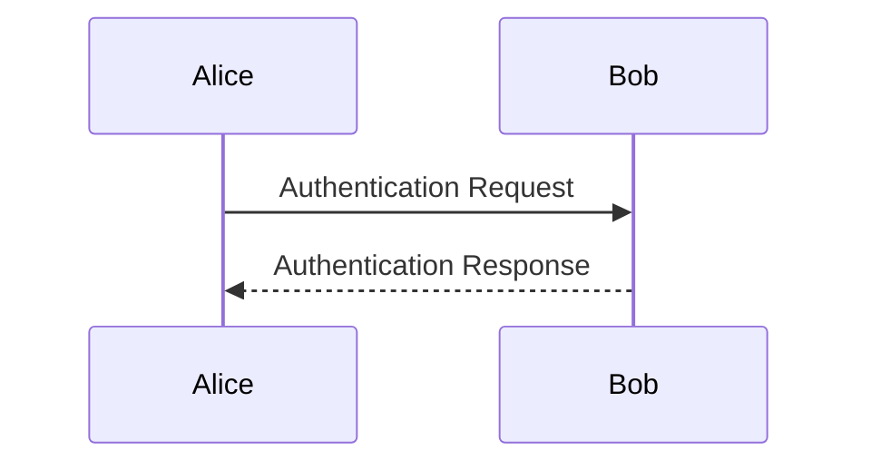

# Markdown 拡張記法サポート設計ドキュメント

> プロジェクト: Markdown / HTML Editor - Typora ライク WYSIWYG エディタ
> バージョン: 1.0
> 更新日: 2026-02-24

---

## 目次

1. [脚注（Footnotes）WYSIWYG 設計](#1-脚注footnotes-wysiwyg-設計)
2. [ハイライト・上付き・下付き](#2-ハイライト上付き下付き)
3. [カスタムコンテナ / Callout ブロック](#3-カスタムコンテナ--callout-ブロック)
4. [目次（TOC）インライン自動生成](#4-目次tocインライン自動生成)
5. [PlantUML / js-sequence-diagrams 対応](#5-plantuml--js-sequence-diagrams-対応)
6. [定義リスト（Definition Lists）対応](#6-定義リスト-definition-lists-対応)

---

## 1. 脚注（Footnotes）WYSIWYG 設計

### 1.1 Markdown 表記

```markdown
本文中に脚注参照[^1]を挿入する。

[^1]: これが脚注の本文です。
```

### 1.2 WYSIWYG 表示仕様

**変換スキーマ**（[markdown-tiptap-conversion.md](./markdown-tiptap-conversion.md) §2.2 で定義済み）:
- 参照側: `footnoteRef` カスタムインラインノード（`identifier` 属性を保持）
- 定義側: `footnoteDefinition` カスタムブロックノード（`identifier`・本文を保持）

**表示方式: インライン参照 + ページ末尾定義**

```
本文中に脚注参照 [¹] を挿入する。

（ドキュメント末尾）
───────────────────────
¹ これが脚注の本文です。
```

- 参照番号（`[¹]`）は自動採番（ドキュメント内の出現順）
- 参照番号をホバーすると脚注本文をツールチップ表示
- 参照番号を Ctrl+クリックで脚注定義へジャンプ

### 1.3 編集 UX

**脚注参照の挿入**:
1. カーソル位置で `Ctrl+Shift+F`（または ツールバーボタン）
2. 脚注識別子を入力するミニダイアログを表示
3. 確認後、参照ノードを挿入し、ドキュメント末尾に対応する定義ノードを追加

**脚注定義の編集**:
- ドキュメント末尾の定義エリアは通常の段落と同様に編集可能
- フォーカス時にソース表示、フォーカス外は上記のスタイルでレンダリング

### 1.4 実装方針

```typescript
// remark-footnotes (remark-gfm の GFM 脚注機能) を使用
// TipTap カスタム拡張:
//   FootnoteRef  (inline node)
//   FootnoteDefinition (block node)
```

`enableFrontMatter` と同様に `enableFootnotes: boolean` 設定で有効/無効を切り替え可能。

---

## 2. ハイライト・上付き・下付き

### 2.1 記法と表示

| 記法 | 意味 | TipTap マーク | 設定キー |
|------|------|--------------|---------|
| `==text==` | ハイライト（背景色） | `highlight` | `enableHighlight` |
| `^text^` | 上付き文字 | `superscript` | `enableSuperscript` |
| `~text~` | 下付き文字 | `subscript` | `enableSubscript` |

### 2.2 WYSIWYG レンダリング

```
ハイライト: ==重要なテキスト== → 重要なテキスト（黄色背景）
上付き:     x^2^              → x²
下付き:     H~2~O             → H₂O
```

- ハイライト色はテーマの `--highlight-bg` CSS 変数で定義（ライト/ダーク対応）
- 上付き・下付きは CSS `vertical-align: super/sub` + `font-size: 75%` で実装

### 2.3 TipTap 拡張

```typescript
// src/renderer/wysiwyg/extensions/extended-marks.ts
import Highlight from '@tiptap/extension-highlight';
import Superscript from '@tiptap/extension-superscript';
import Subscript from '@tiptap/extension-subscript';

// 設定に応じて有効化
const extensions = [
  settings.markdown.enableHighlight ? Highlight : null,
  settings.markdown.enableSuperscript ? Superscript : null,
  settings.markdown.enableSubscript ? Subscript : null,
].filter(Boolean);
```

### 2.4 変換スキーマへの追記

[markdown-tiptap-conversion.md](./markdown-tiptap-conversion.md) §2.2 のインラインノードマッピングに追加:

| mdast ノード | TipTap Mark | 記法プラグイン |
|---|---|---|
| `highlight` | `highlight` mark | remark-mark（または remark-extended-table） |
| `superscript` | `superscript` mark | remark-supersub |
| `subscript` | `subscript` mark | remark-supersub |

---

## 3. カスタムコンテナ / Callout ブロック

### 3.1 対応方針

**採用方針**: MVP（Phase 1〜4）では未対応とし、Phase 7 以降でプラグインとして実装する。

理由:
- `:::warning` 記法は標準 GFM ではなく、markdown-it-container 等の独自拡張
- remark での対応には remark-directive または remark-containers プラグインが必要
- サポートする場合は Obsidian 互換の `> [!NOTE]` 形式を優先採用

### 3.2 採用するコンテナ形式

将来対応時は **GitHub / Obsidian スタイルの callout** を採用する:

```markdown
> [!NOTE]
> これはノートです。

> [!WARNING]
> これは警告です。

> [!TIP]
> これはヒントです。
```

**レンダリング**:
```
╔════════════════════════════════╗
║ ℹ️ NOTE                        ║
║ これはノートです。               ║
╚════════════════════════════════╝

╔════════════════════════════════╗
║ ⚠️ WARNING                     ║
║ これは警告です。                ║
╚════════════════════════════════╝
```

### 3.3 実装予定（Phase 7 以降）

- TipTap カスタム BlockNode `callout`（`type: 'note' | 'warning' | 'tip' | 'danger'`）
- remark-directive プラグインで Markdown をパース
- テーマの CSS 変数でカラーを定義

---

## 4. 目次（TOC）インライン自動生成

### 4.1 方式

エディタ内で `[toc]` または `[[toc]]` と入力すると、ドキュメントの見出し一覧を自動生成する。

```markdown
# ドキュメントタイトル

[toc]

## セクション 1
## セクション 2
```

↓ WYSIWYG レンダリング:

```
[目次]
  1. セクション 1
  2. セクション 2
```

### 4.2 TipTap 拡張設計

```typescript
// src/renderer/wysiwyg/extensions/toc-node.ts

const TocNode = Node.create({
  name: 'tableOfContents',
  group: 'block',
  atom: true, // 編集不可の単一ノード

  addAttributes() {
    return {};
  },

  // レンダリング: ドキュメントの見出しを取得して TOC を描画
  addNodeView() {
    return ReactNodeViewRenderer(TocNodeView);
  },
});

function TocNodeView({ editor }: NodeViewProps) {
  const headings = useHeadings(editor); // アウトラインパネルと同じロジック
  return (
    <NodeViewWrapper contentEditable={false}>
      <nav className="toc">
        <ol>{headings.map(h => <li key={h.pos}>{h.text}</li>)}</ol>
      </nav>
    </NodeViewWrapper>
  );
}
```

### 4.3 Input Rule

```typescript
// "[toc]" または "[[toc]]" → tableOfContents ノードに変換
const tocInputRule = textInputRule({
  find: /\[{1,2}toc\]{1,2}$/,
  type: editor.schema.nodes.tableOfContents,
});
```

### 4.4 エクスポート時

HTML エクスポート時は [export-design.md](./export-design.md) §2.1 の `rehypeToc()` で生成した TOC に置き換える。

---

## 5. PlantUML / js-sequence-diagrams 対応

### 5.1 対応方針

**Phase 7 以降で検討**。Mermaid.js が優先実装済みのため。

### 5.2 PlantUML

PlantUML はサーバーサイドレンダリングが必要（Java 環境または公開 API）。
ローカルで完結しないため採用コストが高く、**オプションプラグインとして提供**する方針とする。

```markdown

```

- 実装方法: PlantUML の公開 Web API（`www.plantuml.com/plantuml/svg/...`）を利用
  - オフライン時は「PlantUML サーバーに接続できません」を表示
  - ローカル PlantUML JAR のパスを設定で指定可能

### 5.3 js-sequence-diagrams

**採用しない**。Mermaid.js がシーケンス図に対応しているため代替可能。
Mermaid の `sequenceDiagram` 記法を推奨する。

```markdown

```

---

## 6. 定義リスト（Definition Lists）対応

### 6.1 記法

PHP Markdown Extra / pandoc 拡張の定義リスト記法に対応する。

```markdown
りんご
:   甘い果物。赤や青のものがある。

みかん
:   冬に出回る柑橘類。
```

↓ レンダリング:

**りんご**
: 甘い果物。赤や青のものがある。

**みかん**
: 冬に出回る柑橘類。

### 6.2 採用方針

**Phase 7 以降で対応**。利用頻度が低く、remark-deflist プラグインと TipTap カスタムノードの追加が必要なため。

### 6.3 TipTap スキーマ設計（将来実装）

```typescript
// ブロックノード
DefinitionList  → dl 要素
DefinitionTerm  → dt 要素（inline 編集可）
DefinitionDesc  → dd 要素（ブロック編集可）
```

### 6.4 設定キー

```typescript
// user-settings-design.md の MarkdownSettings に追加
enableDefinitionList: boolean; // デフォルト: false（将来）
```

---

## 関連ドキュメント

- [markdown-tiptap-conversion.md](./markdown-tiptap-conversion.md) — 変換スキーマのマッピング
- [user-settings-design.md](./user-settings-design.md) — 拡張記法の有効/無効設定
- [plugin-api-design.md](./plugin-api-design.md) — PlantUML プラグインの実装基盤
- [editor-ux-design.md](./editor-ux-design.md) — アウトラインパネル（TOC と共有ロジック）
